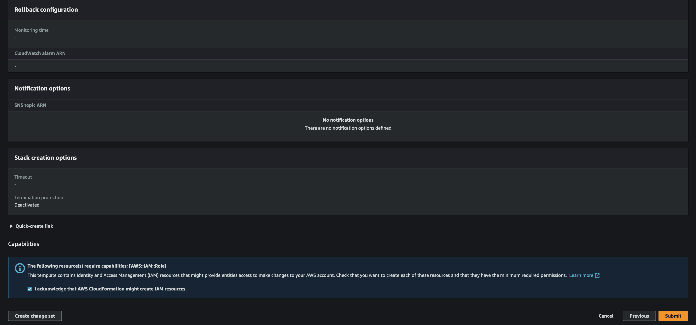

# VPC, SageMaker Notebook 및 FSX for Luster 생성 가이드

아래는 다음과 같은 단계로 환경을 설정 합니다.
- VPC (Virtual Private Cloud) 생성 및 SageMaker Notebook Instance 생성
- FSx for Luster 파일 시스템 생성
- SageMaker Notebook Instance 에 Luster Client 설치 및 Luster 마운트 및 파일 생성 테스트


# 1. Create VPC and SageMaker Notebook
- 첨부된 [cfn-vpc-sm.yaml](cfn-vpc-sm.yaml) 를 로컬 머신으로 다운로드 함.
- [AWS CloudFormation](https://console.aws.amazon.com/cloudformation/) 로 접속
- "cfn-vpc-sm.yaml" 를 업로딩 한 후에 다음 단계 진행
    - 
- stack name 을 기술
    - 
- 디폴트로 두고, 다음 클릭
    - 
- 동의에 체크하고 제출을 함
    - 
- 약 10분이 지나면, 아래와 같이 Output 이 생성됨.
    - 

# 2. Create FSx for Luster File System
- [FSx for Luster](https://console.aws.amazon.com/fsx) 로 로긴 합니다.
    - 
- 파일 시스템에서 FSx for Luster 를 선택 합니다.
    -     
- 파일 시스템 이름을 적고, 스토리지 타입을 선택 합니다.    
    - 
- 이전 단계에서 생성한 VPC ID, VPC Security Group, Security Group, Subnet 을 선택 합니다.     
    - 
- 약 10분이 지나면 파일 시스템을 사용할 수 있습니다.    
    - 

# 3. Mount Luster to Sagemaker Notebook
- SageMaker Console 로 이동 합니다.
- 해당 노트북의 "Open JupyterLab" 을 클릭 하여, 주피터 랩을 오픈 합니다.    
    - 
- File --> Terminal 을 선택하여 터미널을 생성 합니다.
    
- 아래와 같이 터미널에 명령어를 입력합니다.
    ```bash
    uname -r
    sudo amazon-linux-extras install -y lustre
    ```
    - 
- FSx for Luster 콘솔로 이동하여 생성한 파일 시스템을 클릭하면 오른쪽 상단에 "Attach" 를 클릭 합니다.    
    - 
- 생성된 Attach 명령어 (폴더 생성 포함) 를 복사 합니다.    
    - 
- 위의 복사된 명령어를 실행하고, 아래와 같이 파일을 하나 테스트로 생성 합니다.    
    - 
    
    
축하 합니다! . 이제 FSx for Luster 를 위한 환경 설정이 완료 되었습니다.
